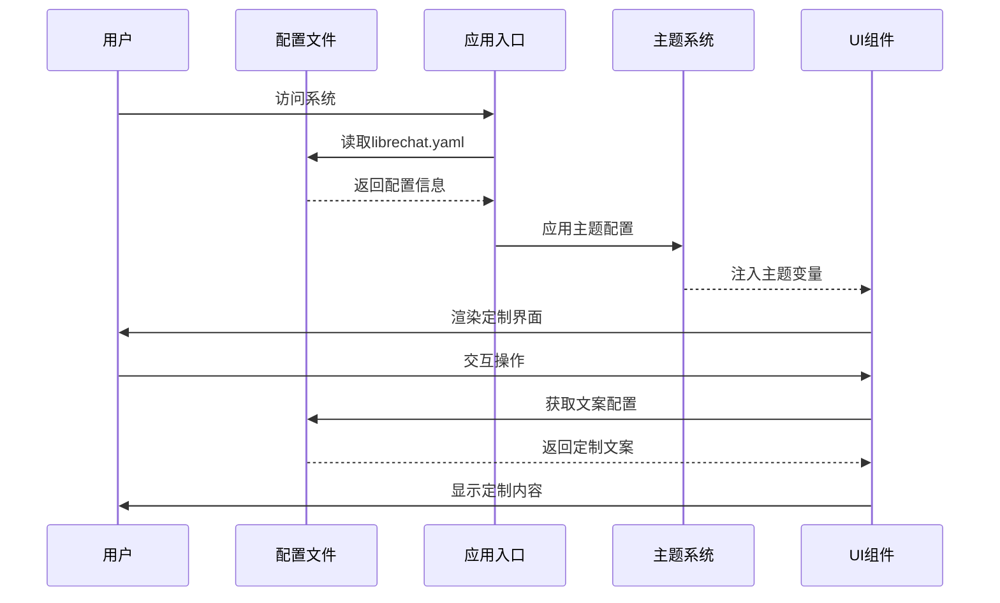
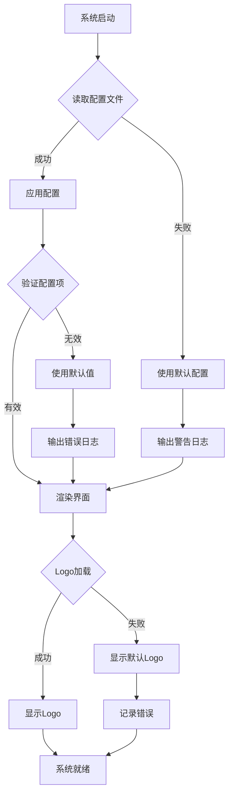

# 设计文档

## 概述

本设计文档详细说明了如何将LibreChat前端界面定制为"无线随申查（开放版）"系统，以满足上海市无线电监测站的专业需求。设计遵循政府机关部门的严肃、专业风格，同时保持系统的易用性和功能完整性。

### 设计目标

1. **品牌一致性**：将系统品牌标识更新为上海市无线电监测站的官方形象
2. **专业风格**：采用符合政府机关部门要求的视觉设计语言
3. **功能定制**：调整文案和术语以匹配无线电监测工作场景
4. **可维护性**：通过配置文件管理定制内容，便于后续更新
5. **响应式设计**：确保在各种设备上都能提供良好的用户体验

### 技术栈

- **前端框架**：React 18+ with TypeScript
- **状态管理**：Recoil
- **样式方案**：Tailwind CSS
- **UI组件**：Radix UI
- **动画库**：Framer Motion
- **构建工具**：Vite

## 架构

### 系统架构概览

```
┌─────────────────────────────────────────────────────────────┐
│                     配置层 (Configuration Layer)              │
│  ┌──────────────┐  ┌──────────────┐  ┌──────────────┐      │
│  │ librechat.yaml│  │  .env文件    │  │  主题配置    │      │
│  └──────────────┘  └──────────────┘  └──────────────┘      │
└─────────────────────────────────────────────────────────────┘
                              ↓
┌─────────────────────────────────────────────────────────────┐
│                    应用层 (Application Layer)                │
│  ┌──────────────────────────────────────────────────────┐   │
│  │              React Application (App.jsx)              │   │
│  │  ┌────────────┐  ┌────────────┐  ┌────────────┐     │   │
│  │  │ ThemeProvider│ │ RecoilRoot │ │ RouterProvider│   │   │
│  │  └────────────┘  └────────────┘  └────────────┘     │   │
│  └──────────────────────────────────────────────────────┘   │
└─────────────────────────────────────────────────────────────┘
                              ↓
┌─────────────────────────────────────────────────────────────┐
│                   组件层 (Component Layer)                   │
│  ┌──────────────┐  ┌──────────────┐  ┌──────────────┐      │
│  │  导航栏组件  │  │  欢迎页组件  │  │  登录页组件  │      │
│  │  (Nav.tsx)   │  │(Landing.tsx) │  │(Login.tsx)   │      │
│  └──────────────┘  └──────────────┘  └──────────────┘      │
│  ┌──────────────┐  ┌──────────────┐  ┌──────────────┐      │
│  │  头部组件    │  │  对话组件    │  │  设置组件    │      │
│  │(Header.tsx)  │  │(ChatView.tsx)│  │(Settings.tsx)│      │
│  └──────────────┘  └──────────────┘  └──────────────┘      │
└─────────────────────────────────────────────────────────────┘
                              ↓
┌─────────────────────────────────────────────────────────────┐
│                   资源层 (Assets Layer)                      │
│  ┌──────────────┐  ┌──────────────┐  ┌──────────────┐      │
│  │  Logo文件    │  │  Favicon     │  │  主题颜色    │      │
│  └──────────────┘  └──────────────┘  └──────────────┘      │
└─────────────────────────────────────────────────────────────┘
```

### 定制化策略

系统采用**配置驱动**的定制化策略，通过以下三个层次实现：

1. **配置文件层**：通过`librechat.yaml`和环境变量配置应用名称、欢迎语等
2. **主题层**：通过Tailwind CSS配置和CSS变量定义政府风格配色
3. **组件层**：修改关键组件的文案、图标和布局

## 组件和接口

### 核心组件清单

#### 1. 品牌标识组件

**Logo组件位置**：
- `client/public/assets/` - Logo资源文件
- `client/src/components/Auth/AuthLayout.tsx` - 登录页Logo
- `client/src/components/Nav/Nav.tsx` - 导航栏Logo
- `client/public/index.html` - Favicon配置

**接口定义**：
```typescript
interface LogoConfig {
  logoPath: string;           // Logo文件路径
  faviconPath: string;        // Favicon路径
  appTitle: string;           // 应用标题："无线随申查（开放版）"
  altText: string;            // 图片alt文本
}
```

#### 2. 欢迎页面组件

**组件路径**：`client/src/components/Chat/Landing.tsx`

**接口定义**：
```typescript
interface LandingConfig {
  welcomeMessage: string;     // 欢迎语
  description: string;        // 系统功能描述
  showGreeting: boolean;      // 是否显示时间问候
  customIcon?: string;        // 自定义图标URL
}
```

#### 3. 导航栏组件

**组件路径**：`client/src/components/Nav/Nav.tsx`

**接口定义**：
```typescript
interface NavigationConfig {
  conversationsLabel: string;  // "工作记录"
  newChatLabel: string;        // "新建咨询"
  searchPlaceholder: string;   // 搜索占位符
  settingsLabel: string;       // "设置"
}
```

#### 4. 登录页面组件

**组件路径**：`client/src/components/Auth/Login.tsx`, `AuthLayout.tsx`

**接口定义**：
```typescript
interface LoginPageConfig {
  title: string;              // "无线随申查（开放版）"
  subtitle?: string;          // 副标题
  footerText: string;         // "© 2025 上海市无线电监测站"
  organizationInfo: string;   // "上海市经济和信息化委员会"
}
```

#### 5. 主题配置组件

**组件路径**：`client/src/App.jsx`, Tailwind配置

**接口定义**：
```typescript
interface ThemeConfig {
  primaryColor: string;       // 主色调（深蓝色）
  accentColor: string;        // 强调色（红色）
  backgroundColor: string;    // 背景色
  textColor: string;          // 文字颜色
  borderRadius: string;       // 圆角大小
  fontFamily: string;         // 字体族
}
```

### 组件交互流程



## 数据模型

### 配置数据模型

#### librechat.yaml配置结构

```yaml
# 应用配置
version: 1.2.1

# 界面定制配置
interface:
  # 自定义欢迎语
  customWelcome: '欢迎使用无线随申查（开放版）'
  
  # 应用标题
  appTitle: '无线随申查（开放版）'
  
  # 系统描述
  appDescription: '本系统为无线电监测站工作人员提供智能问答服务，协助处理无线电监测、干扰查找、设备检测、频谱分析等相关工作'
  
  # 隐私政策和服务条款
  privacyPolicy:
    externalUrl: 'https://example.com/privacy'
    openNewTab: true
  
  termsOfService:
    externalUrl: 'https://example.com/terms'
    openNewTab: true
    modalAcceptance: true
    modalTitle: '无线随申查服务条款'
```

#### 环境变量配置

```bash
# 应用基本信息
APP_TITLE="无线随申查（开放版）"
VITE_APP_TITLE="无线随申查（开放版）"

# 主题颜色配置（可选，通过环境变量覆盖）
VITE_THEME_PRIMARY="#1E3A8A"
VITE_THEME_ACCENT="#DC2626"
VITE_THEME_BACKGROUND="#F9FAFB"
```

#### 本地化文案数据模型

```typescript
// 中文本地化配置
interface LocalizationStrings {
  // 导航相关
  'com_ui_chat_history': '工作记录',
  'com_ui_new_chat': '新建咨询',
  'com_ui_search': '搜索工作记录',
  
  // 欢迎页相关
  'com_ui_welcome': '欢迎使用无线随申查（开放版）',
  'com_ui_system_description': '本系统为无线电监测站工作人员提供智能问答服务',
  
  // 输入提示
  'com_ui_input_placeholder': '请输入您的问题或工作需求...',
  
  // 功能按钮
  'com_ui_upload_file': '上传工作文档',
  'com_ui_settings': '设置',
  'com_ui_account': '个人信息',
  'com_ui_logout': '退出登录',
  
  // 示例问题
  'com_ui_example_1': '如何处理无线电干扰投诉？',
  'com_ui_example_2': '频谱监测的标准流程是什么？',
  'com_ui_example_3': '设备检测需要哪些技术参数？',
}
```

### 主题数据模型

#### Tailwind配置扩展

```javascript
// tailwind.config.js 扩展配置
module.exports = {
  theme: {
    extend: {
      colors: {
        // 政府风格配色
        'gov-primary': {
          DEFAULT: '#1E3A8A',  // 深蓝色主色调
          light: '#3B82F6',
          dark: '#1E40AF',
        },
        'gov-accent': {
          DEFAULT: '#DC2626',  // 红色强调色
          light: '#EF4444',
          dark: '#B91C1C',
        },
        'gov-background': {
          DEFAULT: '#F9FAFB',  // 浅灰背景
          dark: '#111827',     // 深色模式背景
        },
        'gov-text': {
          primary: '#111827',
          secondary: '#6B7280',
          inverse: '#FFFFFF',
        },
      },
      fontFamily: {
        // 政府风格字体
        'gov': [
          'Microsoft YaHei',
          'Source Han Sans CN',
          'PingFang SC',
          'Hiragino Sans GB',
          'sans-serif'
        ],
      },
      borderRadius: {
        // 方正风格，减少圆角
        'gov': '4px',
      },
      boxShadow: {
        // 清晰的阴影效果
        'gov': '0 2px 8px rgba(0, 0, 0, 0.1)',
        'gov-lg': '0 4px 16px rgba(0, 0, 0, 0.15)',
      },
    },
  },
}
```

## 正确性属性

在开始编写正确性属性之前，让我先分析每个验收标准的可测试性。


*属性是一个特征或行为，应该在系统的所有有效执行中保持为真——本质上是关于系统应该做什么的正式陈述。属性作为人类可读规范和机器可验证正确性保证之间的桥梁。*

基于需求文档中的验收标准，我们定义以下可测试的正确性属性：

### 属性 1：应用名称一致性
*对于任何*需要显示应用名称的组件，渲染的文本应当包含"无线随申查（开放版）"
**验证需求：1.5**

### 属性 2：用户名个性化
*对于任何*已登录的用户，欢迎语应当包含该用户的姓名
**验证需求：3.5**

### 属性 3：Logo响应式尺寸
*对于任何*屏幕尺寸（桌面、平板、移动），Logo元素的尺寸应当在合理范围内（最小24px，最大120px）
**验证需求：8.4**

### 属性 4：配置文件驱动的欢迎语
*对于任何*在librechat.yaml中设置的customWelcome值，Landing组件应当显示该值作为欢迎语
**验证需求：10.1**

### 属性 5：配置文件驱动的Logo路径
*对于任何*在配置中指定的Logo文件路径，系统应当使用该路径作为Logo的src属性
**验证需求：10.2**

### 属性 6：配置文件驱动的主题颜色
*对于任何*在配置中定义的主题颜色值，系统应当将该颜色应用到相应的UI元素
**验证需求：10.3**

### 属性 7：配置文件驱动的单位名称
*对于任何*在配置中设置的单位名称，系统应当在所有相关位置显示该名称
**验证需求：10.4**

## 错误处理

### 配置文件错误处理

1. **缺失配置项**
   - 当librechat.yaml中缺少必需的配置项时，系统应使用默认值
   - 默认值：appTitle = "LibreChat", customWelcome = "Welcome to LibreChat"
   - 在控制台输出警告信息，提示管理员配置缺失

2. **无效的Logo路径**
   - 当配置的Logo文件路径无效或文件不存在时
   - 系统应显示默认Logo（assets/logo.svg）
   - 在控制台输出错误信息

3. **无效的颜色值**
   - 当配置的主题颜色值格式不正确时
   - 系统应使用默认的政府风格配色
   - 在控制台输出警告信息

### 组件渲染错误处理

1. **Logo加载失败**
   - 使用img标签的onError事件处理
   - 显示占位符或默认图标
   - 记录错误日志

2. **配置加载失败**
   - 使用React Error Boundary捕获配置加载错误
   - 显示友好的错误提示页面
   - 提供重试机制

3. **主题应用失败**
   - 当主题CSS变量应用失败时
   - 回退到默认主题
   - 不影响系统核心功能

### 错误处理流程



## 测试策略

### 单元测试

单元测试用于验证具体的组件行为和配置处理逻辑：

1. **组件渲染测试**
   - 测试Landing组件是否正确显示欢迎语
   - 测试Nav组件是否使用正确的标签文本
   - 测试Login组件是否显示正确的Logo和标题
   - 测试Header组件是否使用定制的按钮文本

2. **配置处理测试**
   - 测试配置文件解析逻辑
   - 测试默认值回退机制
   - 测试配置验证逻辑

3. **主题应用测试**
   - 测试主题颜色是否正确应用到CSS变量
   - 测试深色模式切换
   - 测试字体配置

4. **本地化测试**
   - 测试中文文案是否正确加载
   - 测试专业术语是否正确使用

### 属性测试

属性测试用于验证系统在各种输入下的通用正确性：

**测试框架**：使用`@fast-check/jest`进行属性测试

**测试配置**：每个属性测试至少运行100次迭代

**属性测试用例**：

1. **属性1测试：应用名称一致性**
   ```typescript
   // Feature: radio-monitoring-ui-redesign, Property 1: 应用名称一致性
   test('应用名称在所有组件中保持一致', () => {
     fc.assert(
       fc.property(
         fc.record({
           componentType: fc.constantFrom('Nav', 'Header', 'Login', 'Landing'),
           appTitle: fc.constant('无线随申查（开放版）')
         }),
         ({ componentType, appTitle }) => {
           const rendered = renderComponent(componentType, { appTitle });
           expect(rendered).toContain(appTitle);
         }
       ),
       { numRuns: 100 }
     );
   });
   ```

2. **属性2测试：用户名个性化**
   ```typescript
   // Feature: radio-monitoring-ui-redesign, Property 2: 用户名个性化
   test('欢迎语包含用户姓名', () => {
     fc.assert(
       fc.property(
         fc.string({ minLength: 2, maxLength: 20 }),
         (userName) => {
           const rendered = renderLanding({ user: { name: userName } });
           expect(rendered).toContain(userName);
         }
       ),
       { numRuns: 100 }
     );
   });
   ```

3. **属性3测试：Logo响应式尺寸**
   ```typescript
   // Feature: radio-monitoring-ui-redesign, Property 3: Logo响应式尺寸
   test('Logo尺寸在不同屏幕下保持合理范围', () => {
     fc.assert(
       fc.property(
         fc.integer({ min: 320, max: 2560 }),
         (screenWidth) => {
           const logoSize = getLogoSize(screenWidth);
           expect(logoSize).toBeGreaterThanOrEqual(24);
           expect(logoSize).toBeLessThanOrEqual(120);
         }
       ),
       { numRuns: 100 }
     );
   });
   ```

4. **属性4-7测试：配置驱动属性**
   ```typescript
   // Feature: radio-monitoring-ui-redesign, Property 4-7: 配置驱动
   test('配置文件驱动的UI元素', () => {
     fc.assert(
       fc.property(
         fc.record({
           customWelcome: fc.string({ minLength: 5, maxLength: 100 }),
           logoPath: fc.string(),
           primaryColor: fc.hexaString({ minLength: 7, maxLength: 7 }),
           orgName: fc.string({ minLength: 3, maxLength: 50 })
         }),
         (config) => {
           applyConfig(config);
           const rendered = renderApp();
           
           expect(rendered.welcomeText).toBe(config.customWelcome);
           expect(rendered.logoSrc).toBe(config.logoPath);
           expect(rendered.primaryColor).toBe(config.primaryColor);
           expect(rendered.orgName).toBe(config.orgName);
         }
       ),
       { numRuns: 100 }
     );
   });
   ```

### 集成测试

集成测试验证多个组件协同工作的场景：

1. **完整登录流程测试**
   - 访问登录页面
   - 验证Logo、标题、版权信息显示
   - 登录后验证欢迎页面显示

2. **主题切换测试**
   - 切换深色/浅色模式
   - 验证所有组件的配色更新

3. **响应式布局测试**
   - 模拟不同屏幕尺寸
   - 验证布局自适应

4. **配置更新测试**
   - 修改配置文件
   - 重启应用
   - 验证新配置生效

### 端到端测试

使用Playwright进行端到端测试：

1. **用户完整工作流程**
   - 打开浏览器访问系统
   - 登录系统
   - 创建新的工作咨询
   - 上传工作文档
   - 查看工作记录

2. **视觉回归测试**
   - 截图对比关键页面
   - 验证UI风格一致性

### 测试覆盖率目标

- 单元测试覆盖率：≥ 80%
- 属性测试：覆盖所有定义的正确性属性
- 集成测试：覆盖主要用户流程
- 端到端测试：覆盖关键业务场景

## 实施计划概述

实施将分为以下几个阶段：

### 阶段1：基础配置和资源准备
- 准备Logo文件（转换.ai为SVG/PNG）
- 配置librechat.yaml
- 设置环境变量
- 配置Tailwind主题

### 阶段2：核心组件定制
- 修改Landing组件（欢迎页面）
- 修改Login组件（登录页面）
- 修改Nav组件（导航栏）
- 修改Header组件（头部）

### 阶段3：文案和本地化
- 更新中文本地化文件
- 替换所有通用文案为专业术语
- 更新示例问题和帮助文档

### 阶段4：主题和样式
- 应用政府风格配色
- 调整字体和排版
- 优化响应式布局

### 阶段5：测试和验证
- 编写单元测试
- 编写属性测试
- 执行集成测试
- 进行端到端测试
- 修复发现的问题

### 阶段6：文档和部署
- 更新用户文档
- 编写管理员配置指南
- 准备部署方案
- 进行用户培训

每个阶段都将包含详细的任务清单，确保实施的系统性和完整性。


## 友情链接板块设计

### 组件位置和布局

友情链接板块将放置在页面底部（Footer区域），采用可折叠的分类展示方式。

### 组件结构

```typescript
interface LinkCategory {
  title: string;           // 分类标题："友情链接"、"地方频道"、"国际链接"
  links: LinkItem[];       // 该分类下的链接列表
  isExpanded: boolean;     // 是否展开
}

interface LinkItem {
  title: string;           // 链接显示文本
  url: string;             // 链接URL
  target: '_blank';        // 在新标签页打开
  rel: 'nofollow';         // SEO属性
}

interface FooterLinksConfig {
  categories: LinkCategory[];
  supervisionInfo: {
    email: string;         // 纪检监督举报邮箱
    phone: string;         // 纪检监督举报电话
  };
}
```

### 数据配置

友情链接数据将通过配置文件管理，便于后续维护和更新：

```yaml
# librechat.yaml 扩展配置
interface:
  footerLinks:
    enabled: true
    categories:
      - title: "友情链接"
        links:
          - title: "中华人民共和国工业和信息化部"
            url: "http://www.miit.gov.cn"
          - title: "北京东方波泰无线电频谱技术研究所有限公司"
            url: "http://www.oetsi.com"
          - title: "国家无线电监测中心检测中心"
            url: "https://www.srtc.org.cn"
          - title: "中国通信标准化协会"
            url: "http://www.ccsa.org.cn"
          - title: "中国电子学会"
            url: "http://www.cie-info.org.cn"
          - title: "中国工信产业网"
            url: "http://www.cnii.com.cn"
          - title: "电子信息产业网"
            url: "http://www.cena.com.cn"
          - title: "《数字通信世界》"
            url: "http://www.dcw.org.cn"
          - title: "中国无线电协会"
            url: "http://www.rachina.org.cn"
          - title: "ITU无线通信局"
            url: "http://www.itu.int/zh/Pages/default.aspx"
          - title: "亚太电信组织APT"
            url: "http://www.aptsec.org"
      
      - title: "地方频道"
        links:
          - title: "北京"
            url: "http://jxj.beijing.gov.cn/"
          - title: "天津"
            url: "http://gyxxh.tj.gov.cn/"
          - title: "河北"
            url: "http://gxt.hebei.gov.cn/hbgyhxxht/index/index.html"
          - title: "山西"
            url: "http://gxt.shanxi.gov.cn/"
          - title: "内蒙古"
            url: "http://gxt.nmg.gov.cn/index.html"
          - title: "辽宁"
            url: "http://gxt.ln.gov.cn/"
          - title: "吉林"
            url: "http://gxt.jl.gov.cn"
          - title: "黑龙江"
            url: "http://www.hljrm.cn"
          - title: "上海"
            url: "http://www.shanghai.gov.cn/"
          - title: "江苏"
            url: "http://gxt.jiangsu.gov.cn/"
          - title: "浙江"
            url: "http://jxt.zj.gov.cn/"
          - title: "安徽"
            url: "http://jx.ah.gov.cn/"
          - title: "福建"
            url: "http://gxt.fujian.gov.cn/"
          - title: "江西"
            url: "http://gxt.jiangxi.gov.cn/"
          - title: "山东"
            url: "http://gxt.shandong.gov.cn/index.html"
          - title: "河南"
            url: "http://gxt.henan.gov.cn/"
          - title: "湖北"
            url: "http://jxt.hubei.gov.cn/"
          - title: "湖南"
            url: "http://gxt.hunan.gov.cn/wxd_ycl/"
          - title: "广东"
            url: "http://gdii.gd.gov.cn/"
          - title: "广西"
            url: "http://gxt.gxzf.gov.cn/"
          - title: "海南"
            url: "http://iitb.hainan.gov.cn/"
          - title: "重庆"
            url: "http://jjxxw.cq.gov.cn/"
          - title: "四川"
            url: "https://jxt.sc.gov.cn/"
          - title: "贵州"
            url: "http://gxt.guizhou.gov.cn/"
          - title: "云南"
            url: "http://gxt.yn.gov.cn/"
          - title: "西藏"
            url: "http://jxt.xizang.gov.cn/index.html"
          - title: "陕西"
            url: "http://wxd.shaanxi.gov.cn"
          - title: "甘肃"
            url: "http://gxt.gansu.gov.cn/"
          - title: "青海"
            url: "http://www.qhrm.gov.cn"
          - title: "宁夏"
            url: "http://nxww.nx.gov.cn/"
          - title: "新疆"
            url: "http://gxt.xinjiang.gov.cn/"
      
      - title: "国际链接"
        links:
          - title: "美国电子电气工程师学会"
            url: "http://www.ieee.org/index.html"
          - title: "欧洲无线电通信办公室/美洲电信组织"
            url: "http://www.citel.oas.org"
          - title: "美国联邦通信委员会"
            url: "http://www.fcc.gov"
          - title: "乌克兰国家无线电频率和电信监管中心"
            url: "http://www.ucrf.gov.ua"
          - title: "法国频率署"
            url: "http://www.anfr.fr/fr/anfr.html"
          - title: "英国通信办公室"
            url: "http://www.ofcom.org.uk"
          - title: "韩国通信委员会"
            url: "http://eng.kcc.go.kr/user/ehpMain.do"
          - title: "日本总务省信息与通信局"
            url: "http://www.soumu.go.jp/english/icb/index.html"
    
    supervisionInfo:
      email: "jijian@srrc.org.cn"
      phone: "010-68009150"
```

### UI设计规范

#### 布局样式

```css
/* 友情链接板块样式 */
.footer-links {
  background-color: var(--gov-background);
  border-top: 2px solid var(--gov-primary);
  padding: 24px 0;
  margin-top: auto;
}

.footer-links-container {
  max-width: 1200px;
  margin: 0 auto;
  padding: 0 16px;
}

.link-category {
  margin-bottom: 16px;
}

.category-title {
  font-size: 16px;
  font-weight: 600;
  color: var(--gov-primary);
  cursor: pointer;
  padding: 8px 12px;
  background-color: #f3f4f6;
  border-radius: 4px;
  display: flex;
  align-items: center;
  justify-content: space-between;
}

.category-title:hover {
  background-color: #e5e7eb;
}

.category-links {
  display: grid;
  grid-template-columns: repeat(auto-fill, minmax(200px, 1fr));
  gap: 12px;
  padding: 16px 12px;
  background-color: #fafafa;
  border-radius: 0 0 4px 4px;
}

.link-item {
  color: var(--gov-text-primary);
  text-decoration: none;
  padding: 6px 8px;
  border-radius: 4px;
  transition: all 0.2s;
  font-size: 14px;
}

.link-item:hover {
  color: var(--gov-primary);
  background-color: #e5e7eb;
}

.supervision-info {
  margin-top: 24px;
  padding-top: 16px;
  border-top: 1px solid #e5e7eb;
  font-size: 14px;
  color: var(--gov-text-secondary);
}

.supervision-info a {
  color: var(--gov-primary);
  text-decoration: none;
}

.supervision-info a:hover {
  text-decoration: underline;
}
```

#### 响应式设计

```css
/* 移动端适配 */
@media (max-width: 768px) {
  .category-links {
    grid-template-columns: repeat(auto-fill, minmax(150px, 1fr));
    gap: 8px;
  }
  
  .link-item {
    font-size: 13px;
  }
  
  .footer-links {
    padding: 16px 0;
  }
}

@media (max-width: 480px) {
  .category-links {
    grid-template-columns: 1fr;
  }
}
```

### 交互行为

1. **默认状态**：所有分类默认折叠，只显示分类标题
2. **展开/折叠**：点击分类标题切换展开/折叠状态
3. **链接打开**：所有链接在新标签页打开（target="_blank"）
4. **视觉反馈**：鼠标悬停时显示背景色变化
5. **图标指示**：分类标题右侧显示展开/折叠图标（▼/▲）

### 组件实现示例

```typescript
// FooterLinks.tsx
import { useState } from 'react';
import { ChevronDown, ChevronUp } from 'lucide-react';

interface FooterLinksProps {
  config: FooterLinksConfig;
}

export const FooterLinks: React.FC<FooterLinksProps> = ({ config }) => {
  const [expandedCategories, setExpandedCategories] = useState<Set<string>>(new Set());

  const toggleCategory = (title: string) => {
    setExpandedCategories(prev => {
      const newSet = new Set(prev);
      if (newSet.has(title)) {
        newSet.delete(title);
      } else {
        newSet.add(title);
      }
      return newSet;
    });
  };

  return (
    <div className="footer-links">
      <div className="footer-links-container">
        {config.categories.map((category) => (
          <div key={category.title} className="link-category">
            <div 
              className="category-title"
              onClick={() => toggleCategory(category.title)}
              role="button"
              tabIndex={0}
            >
              <span>{category.title}</span>
              {expandedCategories.has(category.title) ? (
                <ChevronUp size={20} />
              ) : (
                <ChevronDown size={20} />
              )}
            </div>
            
            {expandedCategories.has(category.title) && (
              <div className="category-links">
                {category.links.map((link) => (
                  <a
                    key={link.url}
                    href={link.url}
                    target="_blank"
                    rel="nofollow"
                    className="link-item"
                    title={link.title}
                  >
                    {link.title}
                  </a>
                ))}
              </div>
            )}
          </div>
        ))}
        
        {config.supervisionInfo && (
          <div className="supervision-info">
            <div>
              中心纪检监督举报信箱{' '}
              <a href={`mailto:${config.supervisionInfo.email}`} target="_blank">
                {config.supervisionInfo.email}
              </a>
            </div>
            <div>
              中心纪检监督举报电话 {config.supervisionInfo.phone}
            </div>
          </div>
        )}
      </div>
    </div>
  );
};
```

### 可访问性考虑

1. **键盘导航**：支持Tab键导航和Enter键展开/折叠
2. **ARIA属性**：添加适当的role和aria-label
3. **焦点管理**：确保焦点状态清晰可见
4. **屏幕阅读器**：提供有意义的标签和描述

### 性能优化

1. **懒加载**：友情链接组件可以懒加载，减少初始加载时间
2. **虚拟滚动**：如果链接数量很大，考虑使用虚拟滚动
3. **缓存配置**：友情链接配置可以缓存，减少重复请求

### 正确性属性补充

#### 属性 8：友情链接配置驱动
*对于任何*在配置中定义的友情链接分类和链接项，系统应当正确渲染并在新标签页打开
**验证需求：11.1, 11.2, 11.3, 11.4**

#### 属性 9：纪检监督信息显示
*对于任何*配置的纪检监督邮箱和电话，系统应当在友情链接板块底部正确显示
**验证需求：11.5**

## 登录页面详细设计

### 布局结构

登录页面采用全屏背景+居中卡片的布局方式：

```
┌─────────────────────────────────────────────────────────────┐
│  [语言切换: 中文/EN]  [帮助图标]                              │
│                                                               │
│                    [无线电塔背景图 + 蓝色渐变]                 │
│                                                               │
│                  ┌─────────────────────────┐                 │
│                  │    [Logo图标]           │                 │
│                  │                         │                 │
│                  │  无线电监测平台政务管理系统│                 │
│                  │  安全、高效、积累的联务服务入口│              │
│                  │                         │                 │
│                  │  [用户图标] 请输入用户名  │                 │
│                  │  [锁图标] 请输入密码      │                 │
│                  │                         │                 │
│                  │  □ 记住我    忘记密码？  │                 │
│                  │                         │                 │
│                  │      [登录按钮]         │                 │
│                  │                         │                 │
│                  │  没有账号？立即注册      │                 │
│                  └─────────────────────────┘                 │
│                                                               │
│  © 2025 无线电监测平台 | 版权政策 | 联系我们                   │
└─────────────────────────────────────────────────────────────┘
```

### 样式规范

#### 背景层
```css
.login-page-background {
  position: fixed;
  top: 0;
  left: 0;
  width: 100%;
  height: 100%;
  background-image: url('/assets/radio-tower-bg.jpg');
  background-size: cover;
  background-position: center;
  background-repeat: no-repeat;
}

.login-page-overlay {
  position: absolute;
  top: 0;
  left: 0;
  width: 100%;
  height: 100%;
  background: linear-gradient(135deg, 
    rgba(30, 58, 138, 0.85) 0%, 
    rgba(59, 130, 246, 0.75) 100%
  );
}
```

#### 登录卡片
```css
.login-card {
  position: relative;
  z-index: 10;
  width: 90%;
  max-width: 450px;
  margin: 0 auto;
  padding: 48px 40px;
  background: white;
  border-radius: 12px;
  box-shadow: 0 20px 60px rgba(0, 0, 0, 0.3);
}

.login-logo {
  width: 80px;
  height: 80px;
  margin: 0 auto 24px;
  display: block;
}

.login-title {
  font-size: 24px;
  font-weight: 600;
  color: #1E3A8A;
  text-align: center;
  margin-bottom: 8px;
}

.login-subtitle {
  font-size: 14px;
  color: #6B7280;
  text-align: center;
  margin-bottom: 32px;
}
```

#### 输入框
```css
.login-input-group {
  position: relative;
  margin-bottom: 20px;
}

.login-input-icon {
  position: absolute;
  left: 16px;
  top: 50%;
  transform: translateY(-50%);
  color: #9CA3AF;
  width: 20px;
  height: 20px;
}

.login-input {
  width: 100%;
  padding: 12px 16px 12px 48px;
  border: 1px solid #D1D5DB;
  border-radius: 8px;
  font-size: 14px;
  transition: all 0.2s;
}

.login-input:focus {
  outline: none;
  border-color: #3B82F6;
  box-shadow: 0 0 0 3px rgba(59, 130, 246, 0.1);
}

.login-input::placeholder {
  color: #9CA3AF;
}
```

#### 按钮和链接
```css
.login-remember-row {
  display: flex;
  justify-content: space-between;
  align-items: center;
  margin-bottom: 24px;
  font-size: 14px;
}

.login-checkbox-label {
  display: flex;
  align-items: center;
  color: #6B7280;
  cursor: pointer;
}

.login-forgot-link {
  color: #3B82F6;
  text-decoration: none;
  transition: color 0.2s;
}

.login-forgot-link:hover {
  color: #2563EB;
}

.login-button {
  width: 100%;
  padding: 14px;
  background: #1E3A8A;
  color: white;
  border: none;
  border-radius: 8px;
  font-size: 16px;
  font-weight: 500;
  cursor: pointer;
  transition: background 0.2s;
}

.login-button:hover {
  background: #1E40AF;
}

.login-button:active {
  background: #1E3A8A;
  transform: scale(0.98);
}

.login-register-link {
  text-align: center;
  margin-top: 20px;
  font-size: 14px;
  color: #6B7280;
}

.login-register-link a {
  color: #3B82F6;
  text-decoration: none;
  font-weight: 500;
}

.login-register-link a:hover {
  text-decoration: underline;
}
```

#### 顶部工具栏
```css
.login-top-bar {
  position: absolute;
  top: 20px;
  right: 20px;
  z-index: 20;
  display: flex;
  gap: 16px;
  align-items: center;
}

.language-switcher {
  display: flex;
  gap: 8px;
  padding: 8px 16px;
  background: rgba(255, 255, 255, 0.2);
  border-radius: 20px;
  backdrop-filter: blur(10px);
}

.language-option {
  color: white;
  font-size: 14px;
  cursor: pointer;
  padding: 4px 8px;
  border-radius: 4px;
  transition: background 0.2s;
}

.language-option.active {
  background: rgba(255, 255, 255, 0.3);
  font-weight: 500;
}

.help-icon {
  width: 36px;
  height: 36px;
  display: flex;
  align-items: center;
  justify-content: center;
  background: rgba(255, 255, 255, 0.2);
  border-radius: 50%;
  color: white;
  cursor: pointer;
  backdrop-filter: blur(10px);
  transition: background 0.2s;
}

.help-icon:hover {
  background: rgba(255, 255, 255, 0.3);
}
```

## 主界面详细设计

### 布局结构

主界面采用左侧导航+顶部栏+主内容区的经典布局：

```
┌─────────────────────────────────────────────────────────────┐
│ [Logo]        │  [搜索框]              [用户: Admin] [日期]  │
│ 无线随申查     │                                              │
│ (开放版)      │                                              │
├───────────────┼──────────────────────────────────────────────┤
│               │                                              │
│ 🏠 首页       │         智能政务助手                          │
│               │                                              │
│ 📡 无线电监测站│  您好，我是无线电政务智能助手，请问有什么可以帮助？│
│               │                                              │
│ 📄 公文管理    │  ┌──────┐ ┌──────┐ ┌──────┐ ┌──────┐      │
│               │  │查询监测│ │生成报告│ │办理审批│ │查看信息│      │
│ 🤖 智能助手    │  │管理流程│ │告警信息│ │入网申请│ │日报信息│      │
│               │  └──────┘ └──────┘ └──────┘ └──────┘      │
│ 📊 监测报告    │                                              │
│               │                                              │
│ 📖 法规查询    │                                              │
│               │                                              │
│ ⚙️ 系统设置    │                                              │
│               │                                              │
│               │  ┌────────────────────────────────────────┐ │
│               │  │ 请输入您的问题...    🎤 📎        [发送] │ │
│               │  └────────────────────────────────────────┘ │
│               │                                              │
│               │  © 2025 无线电监测站 | 京ICP备XXXXXXXXX号     │
└───────────────┴──────────────────────────────────────────────┘
```

### 导航栏样式

```css
.main-sidebar {
  width: 240px;
  height: 100vh;
  background: #1E3A8A;
  color: white;
  display: flex;
  flex-direction: column;
  position: fixed;
  left: 0;
  top: 0;
  z-index: 100;
}

.sidebar-header {
  padding: 24px 20px;
  border-bottom: 1px solid rgba(255, 255, 255, 0.1);
}

.sidebar-logo {
  width: 48px;
  height: 48px;
  margin-bottom: 12px;
}

.sidebar-title {
  font-size: 18px;
  font-weight: 600;
  line-height: 1.4;
}

.sidebar-menu {
  flex: 1;
  padding: 16px 0;
  overflow-y: auto;
}

.menu-item {
  display: flex;
  align-items: center;
  gap: 12px;
  padding: 12px 20px;
  color: rgba(255, 255, 255, 0.8);
  text-decoration: none;
  transition: all 0.2s;
  cursor: pointer;
}

.menu-item:hover {
  background: rgba(255, 255, 255, 0.1);
  color: white;
}

.menu-item.active {
  background: rgba(59, 130, 246, 0.3);
  color: white;
  border-left: 3px solid #3B82F6;
}

.menu-item-icon {
  width: 20px;
  height: 20px;
  flex-shrink: 0;
}

.menu-item-text {
  font-size: 15px;
}
```

### 顶部栏样式

```css
.main-header {
  height: 64px;
  background: white;
  border-bottom: 1px solid #E5E7EB;
  display: flex;
  align-items: center;
  justify-content: space-between;
  padding: 0 24px;
  margin-left: 240px;
  position: fixed;
  top: 0;
  right: 0;
  left: 240px;
  z-index: 90;
}

.header-search {
  flex: 1;
  max-width: 500px;
  display: flex;
  gap: 8px;
}

.search-input {
  flex: 1;
  padding: 10px 16px;
  border: 1px solid #D1D5DB;
  border-radius: 8px;
  font-size: 14px;
}

.search-button {
  padding: 10px 24px;
  background: #3B82F6;
  color: white;
  border: none;
  border-radius: 8px;
  font-size: 14px;
  cursor: pointer;
  transition: background 0.2s;
}

.search-button:hover {
  background: #2563EB;
}

.header-user-info {
  display: flex;
  align-items: center;
  gap: 16px;
}

.user-name {
  font-size: 14px;
  color: #374151;
}

.user-role {
  font-size: 12px;
  color: #6B7280;
}

.current-date {
  font-size: 14px;
  color: #6B7280;
}

.language-toggle {
  padding: 6px 12px;
  border: 1px solid #D1D5DB;
  border-radius: 6px;
  font-size: 14px;
  cursor: pointer;
  transition: all 0.2s;
}

.language-toggle:hover {
  border-color: #3B82F6;
  color: #3B82F6;
}
```

### 主内容区样式

```css
.main-content {
  margin-left: 240px;
  margin-top: 64px;
  padding: 24px;
  min-height: calc(100vh - 64px);
  background: #F9FAFB;
}

.assistant-container {
  max-width: 1200px;
  margin: 0 auto;
}

.assistant-header {
  text-align: center;
  margin-bottom: 32px;
}

.assistant-title {
  font-size: 32px;
  font-weight: 600;
  color: #1E3A8A;
  margin-bottom: 16px;
}

.assistant-welcome {
  font-size: 16px;
  color: #6B7280;
}

.quick-actions {
  display: grid;
  grid-template-columns: repeat(auto-fit, minmax(250px, 1fr));
  gap: 16px;
  margin-bottom: 32px;
}

.quick-action-card {
  background: white;
  padding: 24px;
  border-radius: 12px;
  box-shadow: 0 2px 8px rgba(0, 0, 0, 0.05);
  cursor: pointer;
  transition: all 0.2s;
  text-align: center;
}

.quick-action-card:hover {
  box-shadow: 0 4px 16px rgba(0, 0, 0, 0.1);
  transform: translateY(-2px);
}

.quick-action-icon {
  width: 48px;
  height: 48px;
  margin: 0 auto 12px;
  color: #3B82F6;
}

.quick-action-title {
  font-size: 16px;
  font-weight: 500;
  color: #374151;
  margin-bottom: 4px;
}

.quick-action-subtitle {
  font-size: 14px;
  color: #6B7280;
}

.chat-input-container {
  background: white;
  border-radius: 12px;
  padding: 16px;
  box-shadow: 0 2px 8px rgba(0, 0, 0, 0.05);
  display: flex;
  gap: 12px;
  align-items: center;
}

.chat-input {
  flex: 1;
  padding: 12px 16px;
  border: 1px solid #E5E7EB;
  border-radius: 8px;
  font-size: 14px;
  resize: none;
}

.chat-input:focus {
  outline: none;
  border-color: #3B82F6;
}

.input-actions {
  display: flex;
  gap: 8px;
}

.input-action-button {
  width: 40px;
  height: 40px;
  display: flex;
  align-items: center;
  justify-content: center;
  border: 1px solid #E5E7EB;
  border-radius: 8px;
  background: white;
  cursor: pointer;
  transition: all 0.2s;
}

.input-action-button:hover {
  background: #F3F4F6;
  border-color: #3B82F6;
}

.send-button {
  padding: 12px 24px;
  background: #3B82F6;
  color: white;
  border: none;
  border-radius: 8px;
  font-size: 14px;
  font-weight: 500;
  cursor: pointer;
  transition: background 0.2s;
}

.send-button:hover {
  background: #2563EB;
}
```

### 响应式设计

```css
/* 平板设备 */
@media (max-width: 1024px) {
  .main-sidebar {
    width: 200px;
  }
  
  .main-header {
    margin-left: 200px;
    left: 200px;
  }
  
  .main-content {
    margin-left: 200px;
  }
  
  .quick-actions {
    grid-template-columns: repeat(2, 1fr);
  }
}

/* 移动设备 */
@media (max-width: 768px) {
  .main-sidebar {
    width: 100%;
    transform: translateX(-100%);
    transition: transform 0.3s;
  }
  
  .main-sidebar.open {
    transform: translateX(0);
  }
  
  .main-header {
    margin-left: 0;
    left: 0;
  }
  
  .main-content {
    margin-left: 0;
  }
  
  .header-search {
    max-width: none;
  }
  
  .quick-actions {
    grid-template-columns: 1fr;
  }
  
  .login-card {
    padding: 32px 24px;
  }
  
  .login-top-bar {
    top: 12px;
    right: 12px;
  }
}

/* 小屏幕移动设备 */
@media (max-width: 480px) {
  .assistant-title {
    font-size: 24px;
  }
  
  .quick-action-card {
    padding: 16px;
  }
  
  .chat-input-container {
    flex-direction: column;
    align-items: stretch;
  }
  
  .input-actions {
    justify-content: space-between;
  }
  
  .send-button {
    width: 100%;
  }
}
```

## 组件实现清单

### 新增组件

1. **LoginBackground.tsx** - 登录页面背景组件
2. **LoginCard.tsx** - 登录卡片组件
3. **LanguageSwitcher.tsx** - 语言切换组件
4. **MainSidebar.tsx** - 主界面侧边导航栏
5. **MainHeader.tsx** - 主界面顶部栏
6. **AssistantWelcome.tsx** - 智能助手欢迎区域
7. **QuickActions.tsx** - 快捷功能按钮组件
8. **ChatInputBar.tsx** - 聊天输入栏组件

### 修改组件

1. **AuthLayout.tsx** - 更新为新的登录页面布局
2. **Root.tsx** - 更新主界面布局结构
3. **Nav.tsx** - 改造为新的侧边导航栏
4. **Header.tsx** - 改造为新的顶部栏

## 正确性属性扩展

#### 属性 10：登录页面背景渲染
*对于任何*登录页面访问，系统应当正确显示背景图片和蓝色渐变叠加层
**验证需求：12.1**

#### 属性 11：导航栏菜单项高亮
*对于任何*当前激活的菜单项，系统应当显示高亮状态（浅蓝色背景和左侧边框）
**验证需求：13.4**

#### 属性 12：响应式导航栏
*对于任何*小于768px的屏幕宽度，导航栏应当可折叠并通过汉堡菜单控制
**验证需求：16.2**

#### 属性 13：触摸区域尺寸
*对于任何*交互元素（按钮、链接等），在触摸设备上的可点击区域应当不小于44x44px
**验证需求：16.5**
